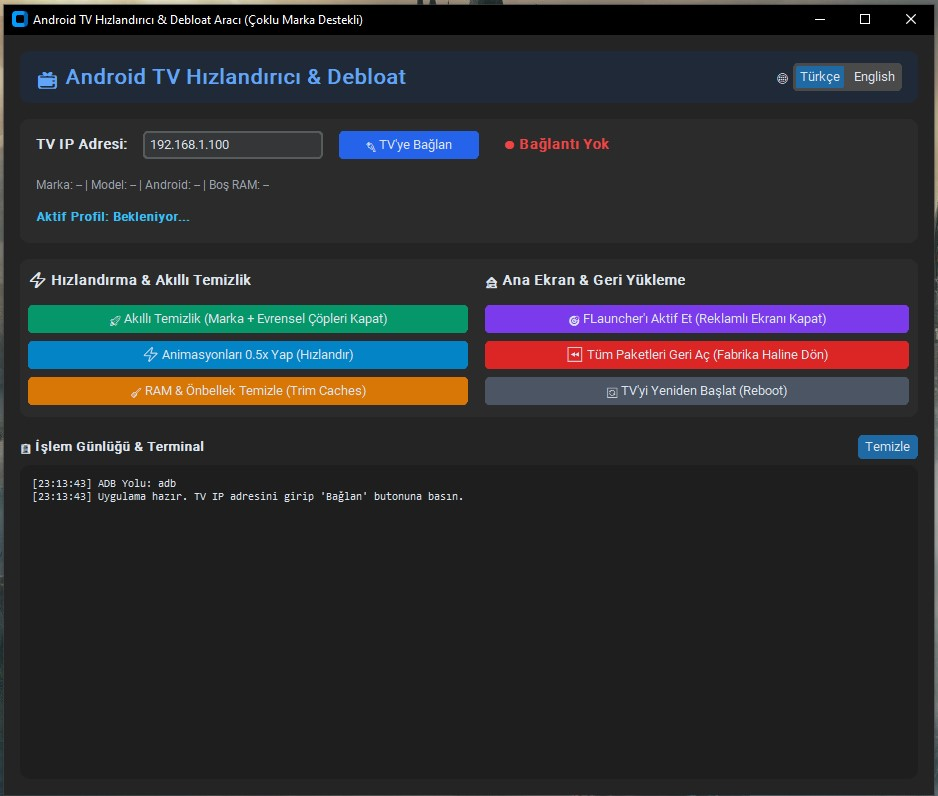

# 📺 Android TV & Google TV Optimizer & Debloat Tool

[🇹🇷 **Türkçe Kullanım Kılavuzu için Tıklayın**](README_TR.md) | [🇬🇧 **English Documentation**](README.md)

---

> **A safe, portable, multi-brand GUI tool to debloat, speed up, and remove ads/recommendations from Android TV & Google TV devices (Philips, TCL, Xiaomi, Sony, Vestel, Chromecast, etc.) via ADB.**

---

## 🌟 Why Choose This Tool?

Smart TV manufacturers and Google load devices with background telemetries, retail store demos, unused sync adapters, and sponsor ad carousels on the home screen. TVs with limited RAM (typically 2GB) quickly experience stutter, input lag, and unresponsive remote controls.

- ✅ **No Root or Bootloader Unlock required.**
- ✅ **Preserves Widevine L1 Certification.** (Netflix, Prime Video, Disney+ continue playing in full 4K HDR).
- ✅ **Zero Risk of Data Loss!** Packages are never uninstalled or deleted (`pm uninstall` is forbidden); they are only safely frozen using `pm disable-user --user 0`.
- ✅ **One-Click Instant Rollback.** Re-enable all stock packages and factory launchers with a single button (`pm enable`).
- ✅ **Protects TV Hardware & Remotes.** TCL Source/Input menus (`com.tcl.suspension`), Philips Ambilight, audio drivers, and keyboards are strictly protected at the code level.
- ✅ **Multilingual GUI.** Toggle between **English** and **Türkçe** dynamically in the top-right corner.
- ✅ **100% Portable.** Python or ADB installation is NOT required on your computer.

---

## 📺 Supported Brands & Smart Profiles
- **Philips:** Special Ambilight, HDMI inputs, and TV tuner protection.
- **TCL:** Quick Panel (`suspension`), Input Switcher, and Bluetooth remote protection.
- **Xiaomi / Mi TV / Mi Box / Stick:** Bluetooth remote, TVInput, and patchwall protection.
- **Sony Bravia:** X-Reality, picture & sound processing engines protection.
- **Vestel / Toshiba / Regal / Grundig:** TV Tuner and inputs protection.
- **Chromecast with Google TV & Generic Android TVs:** Universal safe debloat profile.

---

## 🚀 Quick Start Guide (3 Simple Steps)

### Step 1: Prepare Your TV (One-time setup)
1. On your TV, navigate to **Settings > Device Preferences > About**.
2. Find **"Android TV OS Build"** (or Build Number) and press **OK on your remote 7 times** until it prompts *"You are now a developer!"*.
3. Go back to **Developer Options** and turn ON **"USB Debugging"**.
4. Check your TV's IP address under **Settings > Network & Internet > Connected Network** (e.g., `192.168.1.100`).

> ⚠️ **IMPORTANT:** Your computer and TV must be connected to the **same local Wi-Fi or wired network**.

---

### Step 2: Run the Tool & Connect
1. Extract `Android_TV_Optimizer_Portable.zip`.
2. Launch **`AndroidTV_Optimizer.exe`** (no installation required).
3. Type your TV's IP address and click **"🔌 Connect to TV"**.
4. **Prompt on TV Screen:** When *"Allow USB debugging from this computer?"* appears, check *"Always allow"* and click **OK**.
5. The status badge will turn green, automatically showing your TV brand, model, and available RAM.

---

### Step 3: Clean & Speed Up
- 🚀 **Smart Debloat:** Click to automatically scan installed packages and safely disable bloatware and ad engines tailored to your TV brand.
- ⚡ **Set Animations to 0.5x:** Speeds up UI menu transitions and remote responsiveness by 2x.
- 🧹 **Clean RAM & Cache:** Runs `pm trim-caches` to free up system memory.

---

## 🏠 (Optional) Ad-Free Home Screen with FLauncher
To get rid of Google TV's sponsored video rows and recommendation carousels:
1. Install **FLauncher** from Google Play Store on your TV (free, open-source, no ads).
2. Click **"🎯 Enable FLauncher"** inside the tool.
3. The tool verifies FLauncher is present, then safely disables the stock ad-filled launcher (`tvlauncher` or `launcherx`).

---

## ⏪ Reverting to Factory Stock (One-Click Revert)
If you ever want to revert everything back to stock:
1. Open the tool and connect to your TV.
2. Click **"⏪ Restore All Packages (Factory State)"**.
3. All disabled packages and stock launchers will be instantly re-enabled via `pm enable`.

---

## ❓ FAQ

**Q: Will Netflix, YouTube, or HDMI ports stop working?**  
**A:** No. Hardware drivers, HDMI inputs, remote controls, and DRM/Widevine L1 keys are permanently protected.

**Q: What happens if my TV receives an official OTA update?**  
**A:** Official system updates might re-enable disabled apps. You can simply reconnect with this tool and re-apply debloat in 5 seconds.

**Q: Do I need Python or ADB installed on my PC?**  
**A:** No. The portable build includes all necessary runtimes and ADB binaries.
